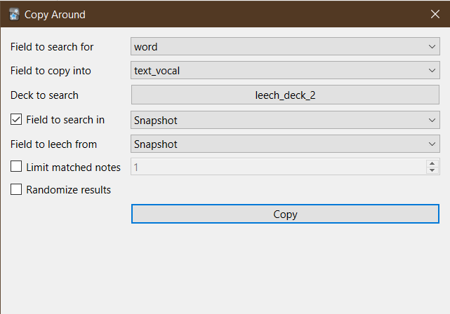

Anki add-on that provides an interface to copy or show related info from notes according to certain search criteria.

The addon's dialog can either be accessed from an editor button or from the browser's **Edit > Copy Around** menu item.



There is also a template filter that can be used to show related information from other notes on-the-fly when reviewing. E.g.

```
{{copyaround deck=leech_deck_2 search_in=Expression leech_from=Snapshot,Audio count=2 shuffle=true:word}}
```

Audios fetched from fields this way don't work unless you also have the [control-audio-playback](https://github.com/abdnh/anki-control-audio-playback/tree/v2) add-on installed.

## TODO

- [ ] document options

## Credit

Icons from https://icons.getbootstrap.com/
